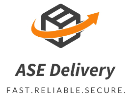
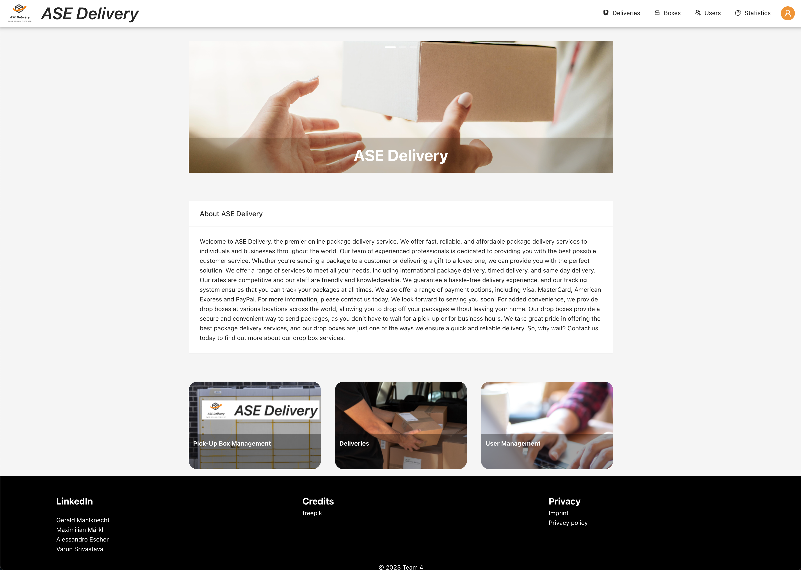
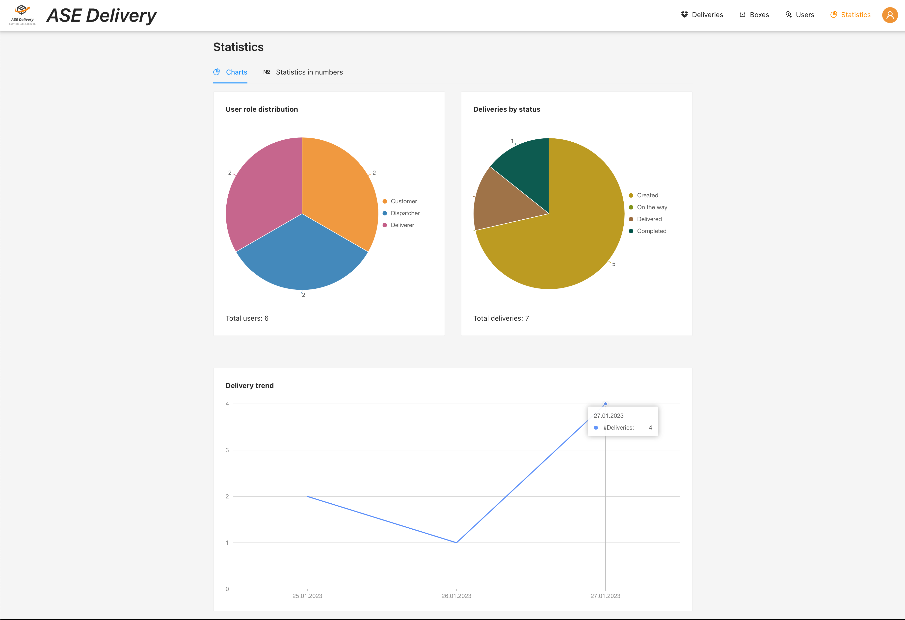

## ASE Delivery Portal

**ASE Delivery Portal** is a web application and one of the core parts of the university project **ASE Delivery**.
The motivation behind ASE Delivery is to build a logistics system to manage package deliveries.
The deliveries are packages sent by dispatchers to predefined pick-up stations. 
Customers who have ordered something from the dispatcher can then pick up the parcels once they have arrived.

## Project Screen Shots

## Documentation

- [User Roles](./documentation/user-roles)
- ASE Delivery Portal
  - [Deliveries](./documentation/deliveries/index.md)
    - [Delivery configuration](./documentation/deliveries/delivery-config.md)
    - [Delivery preview](./documentation/deliveries/delivery-preview.md)
  - [Boxes](./documentation/boxes/index.md)
    - [Box configuration](./documentation/boxes/box-config.md)
    - [Box preview](./documentation/boxes/box-preview.md)
  - [User Management](./documentation/user-management/index.md)
    - [User config](./documentation/user-management/user-config.md)
  - [Statistics](./documentation/statistics/index.md)

## Installation and Setup Instructions

Clone down this repository. You will need `node` and `yarn` installed globally on your machine.

Dependency installation:

`yarn install`

Start in dev mode:

`yarn start`

The page will reload if you make edits.
You will also see any lint errors in the console.

After startup, you can access the frontend using this ip:

[`http://localhost:3000`](http://localhost:3000)

Generation of a project build:

`yarn build`

## Startup

On first startup of the system a demo user with the role `DISPATCHE` is created.
The credentials for this user are
- email: maindispatcher@asedelivery.com
- password: test123

## Requirements

- [x] A dispatcher can create, list, update and delete pick-up boxes through the web GUI.
- [x] A dispatcher can create, list, update and delete deliveries through the web GUI. On the creation of delivery, the dispatcher specifies the target box, the target customer, and the responsible deliverer. The system ensures that the target box is only used for deliveries of one customer.
- [x] A dispatcher can create, list, update and delete other users through the web GUI.
- [x] A deliverer can list boxes to which they are assigned. Afterward, they can change the status of their assigned deliveries from Ordered to Picked-up by scanning the QR code attached to each delivery.
- [x] A customer can list active deliveries and their corresponding pick-up box through the GUI.
- [x] A customer can see past deliveries and their corresponding pick-up boxes through the GUI.
- [x] A customer can track their active delivery by inputting the tracking code in the GUI.

## Author

Gerald Mahlknecht
- [LinkedIn](https://www.linkedin.com/in/gerald-mahlknecht-084074181/)
- [GitHub](https://github.com/Kn3cht)

## Credits

In the context of this university project I used resources from 
[freepik.com](https://freepik.com) to make the user interface more appealing.

