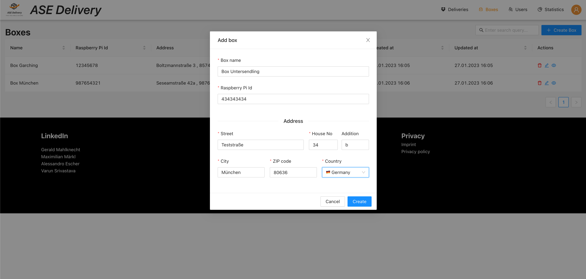

# Box configuration

Requires role `DISPATCHER`.

The box config allows dispatchers to create or update pick-up boxes.

Pick-up boxes contain a `unique` name, the id of the RaspberryPi that is connected with the box and the address at which the box is located.