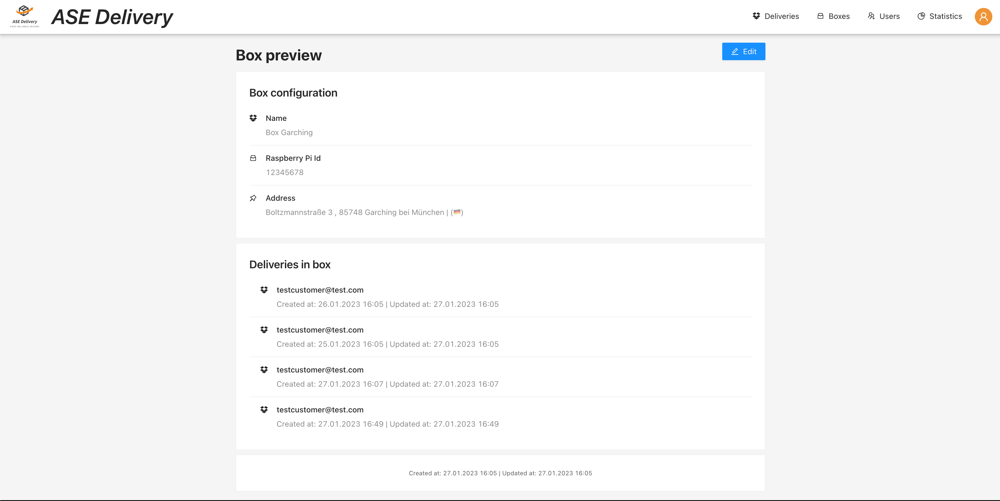

# Box preview

Requires role `DISPATCHER`.

The box preview provides the dispatcher with all box configurations as well as a list
of currently active deliveries in the box (if present).

## Note
Don't get confused. This preview is only accessible for the dispatcher as it also contains information about deliveries 
inside the box which are hidden from all other user roles. In the [delivery preview](../deliveries/delivery-preview.md) a 
minified version of the box preview is shown in the `cascader`.