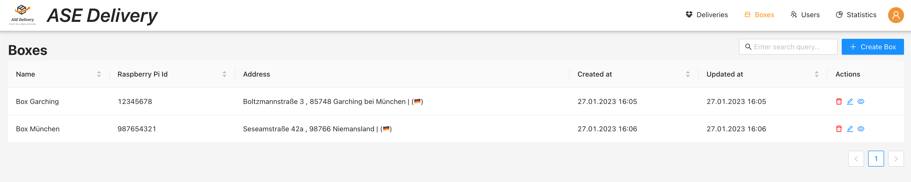

# Boxes

Requires role `DISPATCHER`.

The box table allows dispatchers to 
- fetch
- [create](./box-config.md)
- [update](./box-config.md)
- [preview](./box-preview.md) 
- delete pick-up boxes.

The box table comes with filtering, sorting and a full text search.

