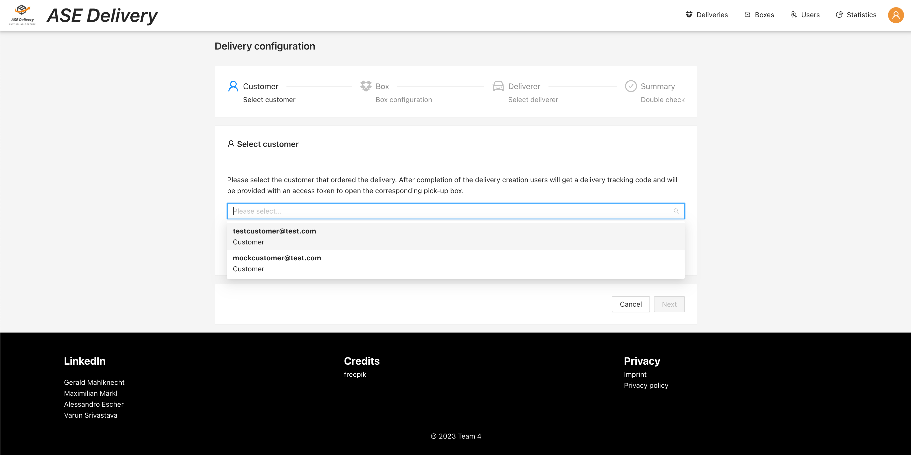
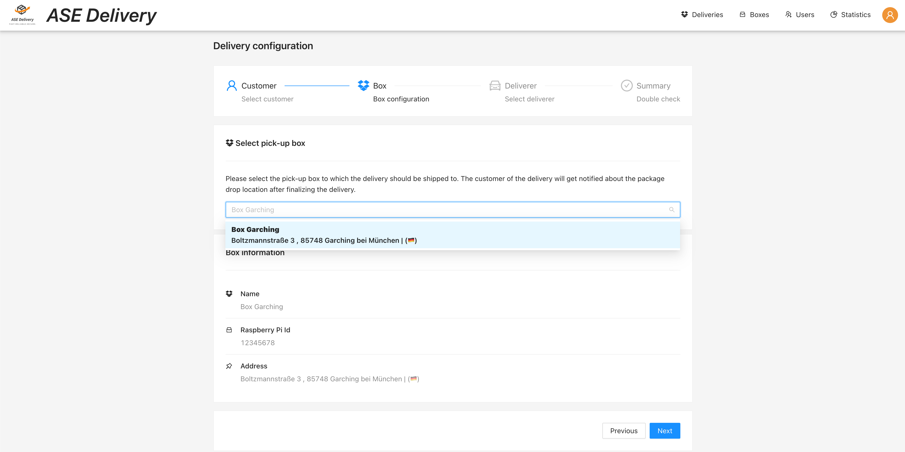
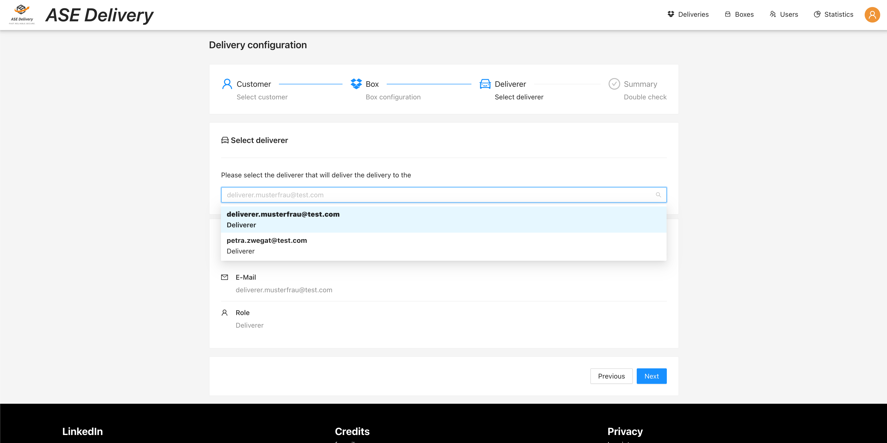
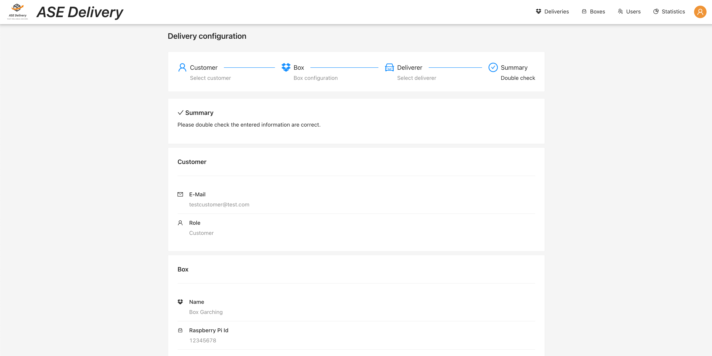
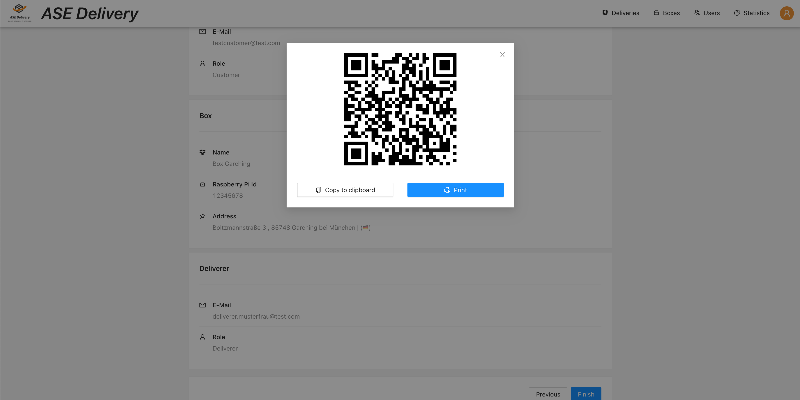

# Delivery Creation

Requires role `DISPATCHER`.

The delivery creation consists of the following configuration steps and a summary view.

## Customer definition

In the first step of the delivery configuration dispatchers must define the customer of the delivery.
This ensures that in the second step only boxes that are available for this customer can be selected.
If a customer is not yet present in the system dispatchers have to create one in the [user management](../user-management/index.md).

## Box definition

In the second step deliverers can select boxes that are available.
A box is considered as available if it is currently *empty* (there are no 
deliveries that have this box assigned which are in a state different from `COMPLETED`) 
or if the box only contains deliveries that are assigned to the previously selected customer.

## Deliverer definition

In the last configuration step the deliverer is assigned to the delivery. The selection logic is the 
same as for the customer selection in step one.

## Summary

The summary contains all previously selected elements for double-checking.

## QR-code

Each delivery (talking of the physical delivery) is assigned a QR-code.
After finalizing the creation of a delivery a modal pops up containing this code.
The modal allows to print the code in order to attach it to the delivery box as well as 
copying the content to the clipboard for testing purposes.

# Edit delivery

Requires role `DISPATCHER`.

The editing process of a delivery is the same as for the creation. When the route is called
with an existing delivery id all fields will be pre-configured and can then be updated.

