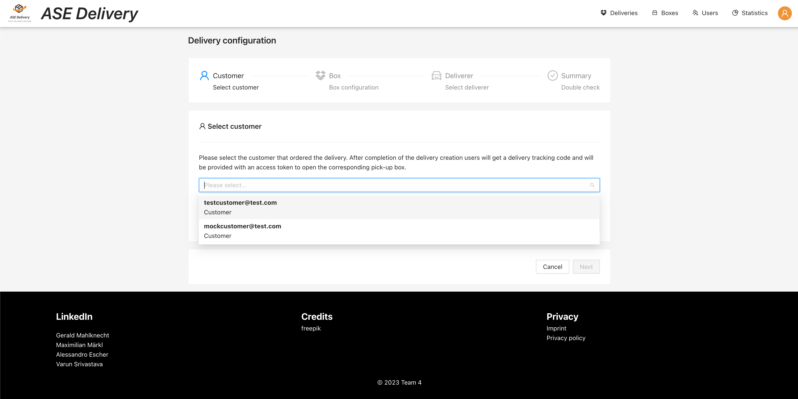

# Delivery preview

Accessible for all roles (see [role restrictions](#role-restrictions))

## Role restrictions

The delivery preview shows information about the selected delivery. The displayed information is dependent on the 
user role:

- `DISPATCHER` can see preview all deliveries
  - Delivery status
  - Customer details
  - Deliverer details
  - Box details
  - QR-code
  - Can edit the delivery
- `DELIVERER` can only preview deliveries that are assigned to them
  - Delivery status
  - QR-code
- `CUSTOMER` can only preview deliveries that are assigned to them 
  - Delivery status
  - Box details

