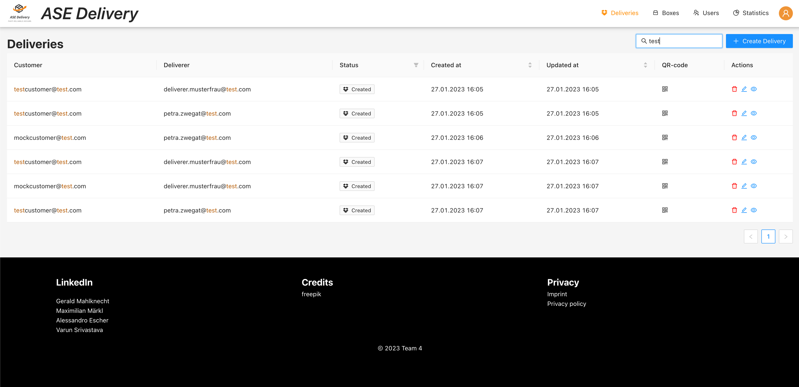

# Deliveries

The delivery table shows deliveries filtered depending on the [user role](../user-roles/index.md).
- `DISPATCHER` have the following permission for all deliveries
  - fetch
  - [preview](./delivery-preview.md)
  - [create](./delivery-config.md)
  - [update](./delivery-config.md)
  - delete
- `CUSTOMER` will only see their deliveries
- `DELIVERER` will only see the deliveries where they are assigned as deliverer

The delivery table comes with filtering, sorting and a full text search.

