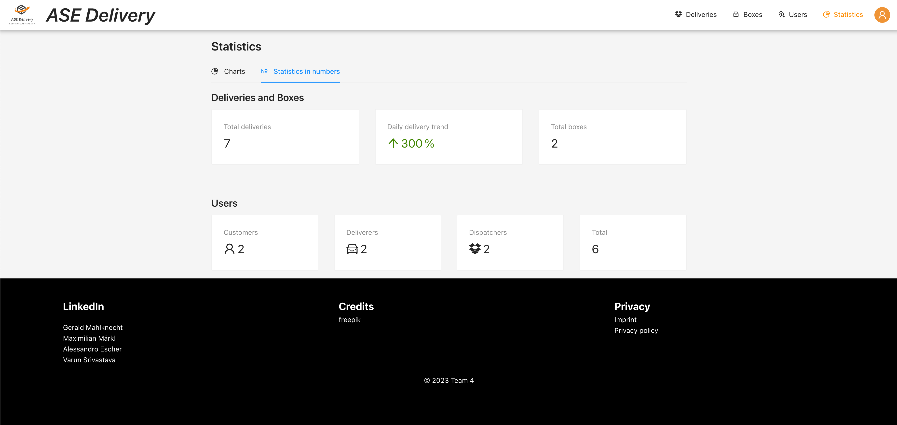

# Statistics

Requires role `DISPATCHER`.

The statistics view provides dispatchers with an overview about user, box and delivery statistics.

## Chart statistics 

The chart statistics show a collection of pie-charts and a line-chart (tend-chart). 

## Number statistics

The number statistics contain all relevant numeric statistics as well as a trend analysis.

