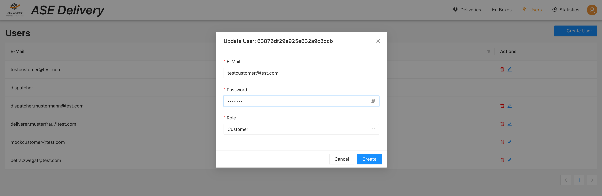

# User configuration

Requires role `DISPATCHER`.

The box config allows dispatchers to create or update users.

Users contain a `unique` name, a password (stored encrypted in the database) and a [user role](../user-roles/index.md).